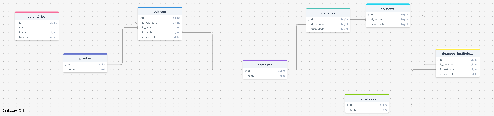

# Sistema de Gestão da Horta

## Entidades

### 1. Voluntários
Representa os voluntários que trabalham na horta comunitária.

**Atributos:**
- id (PK): Identificador único do voluntário
- nome: Nome completo do voluntário
- idade: Idade do voluntário
- funcao: Função exercida (Coordenador, Jardineiro, Voluntário, Educador)

---

### 2. Plantas
Catálogo de tipos de plantas cultivadas na horta.

**Atributos:**
- id (PK): Identificador único da planta
- nome: Nome da planta (Alface, Tomate, Coentro, etc.)

---

### 3. Canteiros
Espaços físicos onde ocorrem os cultivos.

**Atributos:**
- id (PK): Identificador único do canteiro
- nome: Nome/descrição do canteiro

---

### 4. Instituições
Organizações que recebem as doações de alimentos.

**Atributos:**
- id (PK): Identificador único da instituição
- nome: Nome da instituição beneficiada

---

### 5. Cultivos
Registra o plantio de plantas em canteiros por voluntários.

**Atributos:**
- id (PK): Identificador único do cultivo
- id_voluntario (FK): Referência ao voluntário responsável
- id_planta (FK): Referência à planta cultivada
- id_canteiro (FK): Referência ao canteiro utilizado
- created_at: Data do plantio

---

### 6. Colheitas
Registra as colheitas realizadas nos canteiros.

**Atributos:**
- id (PK): Identificador único da colheita
- id_canteiro (FK): Referência ao canteiro colhido
- quantidade: Quantidade colhida (em kg ou unidades)

---

### 7. Doações
Registra as doações geradas a partir das colheitas.

**Atributos:**
- id (PK): Identificador único da doação
- id_colheita (FK): Referência à colheita origem
- quantidade: Quantidade doada

---

### 8. Doações_Instituições
Tabela associativa que registra qual instituição recebeu cada doação.

**Atributos:**
- id (PK): Identificador único do registro
- id_doacao (FK): Referência à doação
- id_instituicao (FK): Referência à instituição receptora
- created_at: Data da doação

---

## Relacionamentos

### Voluntários → Cultivos
- **Cardinalidade:** 1:N (Um voluntário pode realizar vários cultivos)
- **Descrição:** Um voluntário planta e cuida de múltiplos cultivos ao longo do tempo

### Plantas → Cultivos
- **Cardinalidade:** 1:N (Uma planta pode ser cultivada várias vezes)
- **Descrição:** Cada tipo de planta pode ter múltiplos registros de cultivo

### Canteiros → Cultivos
- **Cardinalidade:** 1:N (Um canteiro pode ter vários cultivos)
- **Descrição:** Cada canteiro pode receber diferentes plantas ao longo do tempo

### Canteiros → Colheitas
- **Cardinalidade:** 1:N (Um canteiro pode ter várias colheitas)
- **Descrição:** Cada canteiro gera múltiplas colheitas

### Colheitas → Doações
- **Cardinalidade:** 1:N (Uma colheita pode gerar várias doações)
- **Descrição:** Os produtos de uma colheita podem ser divididos em múltiplas doações

### Doações ↔ Instituições
- **Cardinalidade:** N:M (Muitas doações para muitas instituições)
- **Descrição:** Uma doação pode ser distribuída para várias instituições, e uma instituição recebe várias doações
- **Tabela Associativa:** doacoes_instituicoes

## Fluxo do Sistema

1. **Voluntários** realizam **Cultivos** de **Plantas** em **Canteiros**
2. Os **Canteiros** geram **Colheitas** quando as plantas amadurecem
3. As **Colheitas** são transformadas em **Doações**
4. As **Doações** são distribuídas para **Instituições** através da tabela associativa **Doações_Instituições**

---

## Modelo Lógico



## Regras de Negócio

- Todo cultivo deve ter um voluntário responsável, uma planta e um canteiro
- Toda colheita está associada a um canteiro específico
- Toda doação origina-se de uma colheita
- Uma doação pode ser distribuída para múltiplas instituições
- Uma instituição pode receber doações de diferentes colheitas
- As datas de cultivo e doação são registradas para rastreabilidade


## Criação de base de dados em Docker

``bash
docker run -d --name mysql-teste \
  -e MYSQL_ROOT_PASSWORD=root \
  -e MYSQL_DATABASE=teste \
  -e MYSQL_USER=teste \
  -e MYSQL_PASSWORD=teste \
  -p 3306:3306 \
  mysql:lts --mysql-native-password=ON
```
